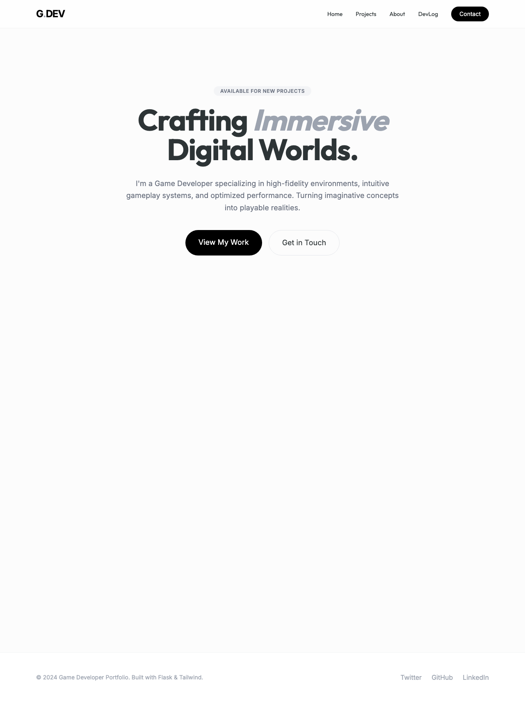
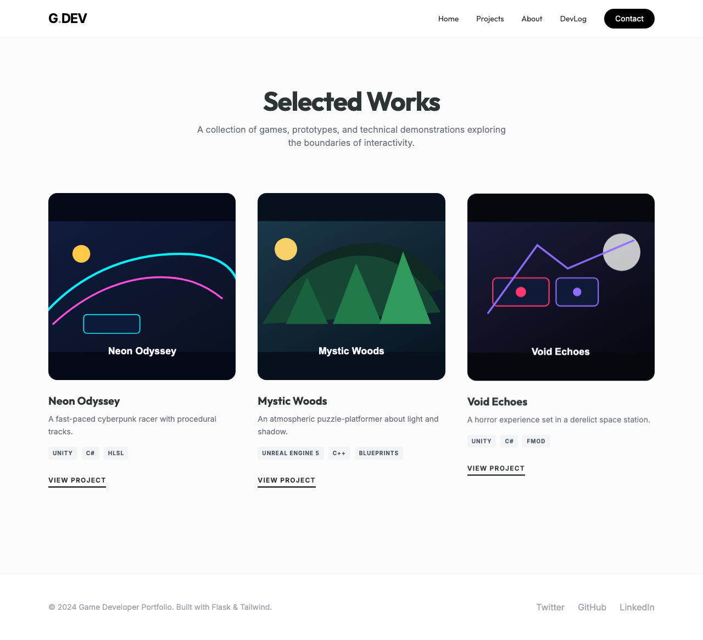
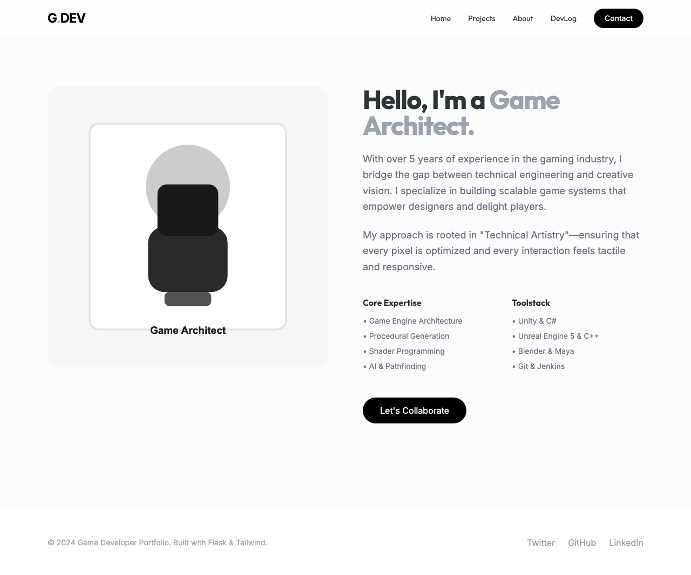
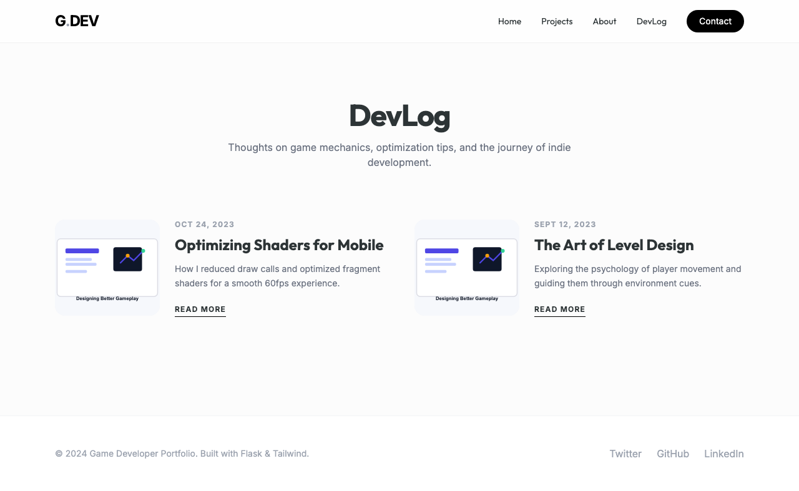
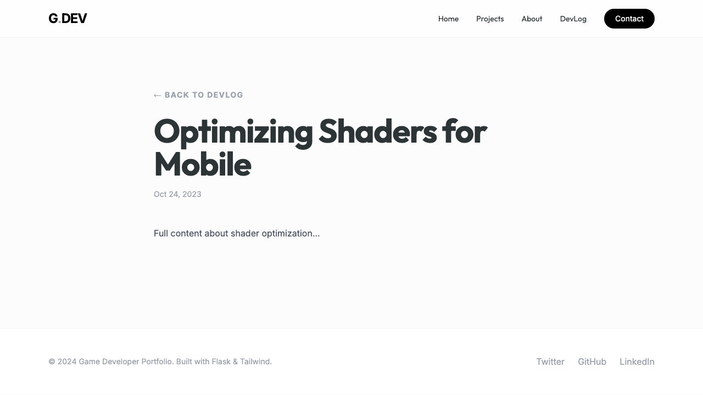
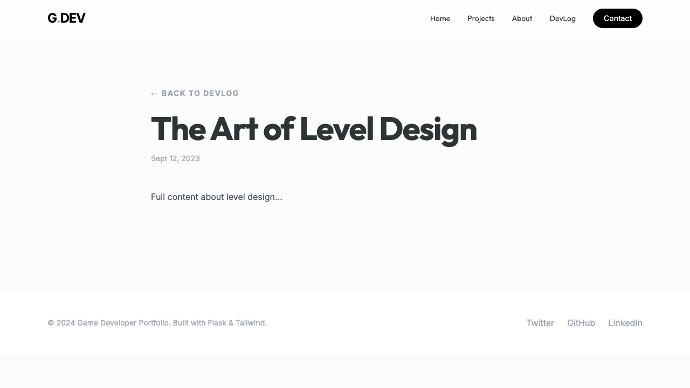
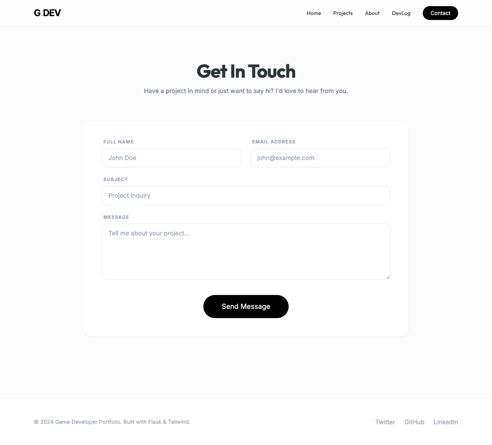

# Game Developer Portfolio

A professional portfolio template designed for game developers to showcase their projects, blog posts, and technical expertise.

> **Important**
> 
> This is a dummy project and portfolio website template created specifically 
> to showcase web development skills. It is free and open-source, meaning 
> anyone can use, modify, or deploy this template for their own needs.

## 🛠 Tech Stack

- **Backend:** Python (Flask)
- **Frontend:** HTML, CSS (Static assets)
- **Testing:** Playwright, TypeScript
- **Environment:** Virtualenv (venv)

## 📂 Directory Structure

```text
.
├── app.py               # Flask application entry point and routing
├── requirements.txt     # Python dependencies
├── package.json         # Node.js scripts and dev dependencies
├── static/              # CSS, images, and client-side assets
├── templates/           # HTML Jinja2 templates for pages
├── test-artifacts/      # Screenshots of the website for documentation
├── e2e/                 # End-to-end tests using Playwright
└── venv/                # Python virtual environment
```

## 🚀 Setup & Installation

### Prerequisites
- Python 3.x
- Node.js & npm

### Installation
1. **Clone the repository:**
   ```bash
   git clone <repository-url>
   cd game_developer_portfolio
   ```

2. **Setup Python Environment:**
   ```bash
   python3 -m venv venv
   source venv/bin/activate  # On Windows: venv\Scripts\activate
   pip install -r requirements.txt
   ```

3. **Install Testing Dependencies:**
   ```bash
   npm install
   npx playwright install
   ```

### Running the Project
To start the development server:
```bash
npm run dev
```
The application will be available at `http://localhost:3000`.

### Running Tests
To execute the end-to-end test suite:
```bash
npm test
```

## ✨ Features

- **Home Page**: High-level overview of the developer and featured projects.
- **Projects Gallery**: Detailed list of developed games with tech stacks (e.g., Unity, UE5).
- **About Me**: Professional biography and skill set.
- **Blog**: A technical blog section for sharing insights on shader optimization and level design.
- **Contact Form**: Functional contact page with submission handling.

## 📸 Screenshots

| Home Page |
| :---: |
|  |
| *Main landing page* |

| Projects Page |
| :---: |
|  |
| *Showcase of all developed games* |

| About Page |
| :---: |
|  |
| *Developer biography and details* |

| Blog Overview |
| :---: |
|  |
| *List of technical blog posts* |

| Blog Post 1 |
| :---: |
|  |
| *Detailed technical article view* |

| Blog Post 2 |
| :---: |
|  |
| *Another technical article view* |

| Contact Page |
| :---: |
|  |
| *Contact form for inquiries* |

## 📜 License
Licensed under MIT — see [LICENSE](LICENSE)

## ✉️ Contact
[Harsh Valecha](https://harshvalecha.vercel.app)
